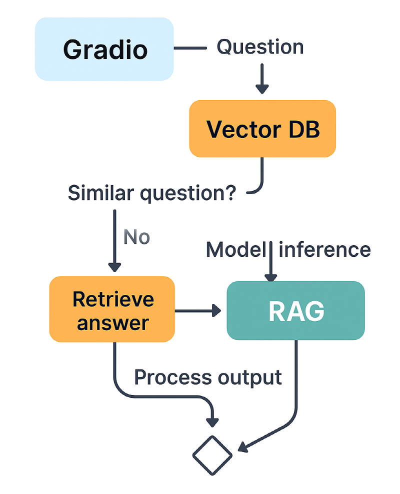
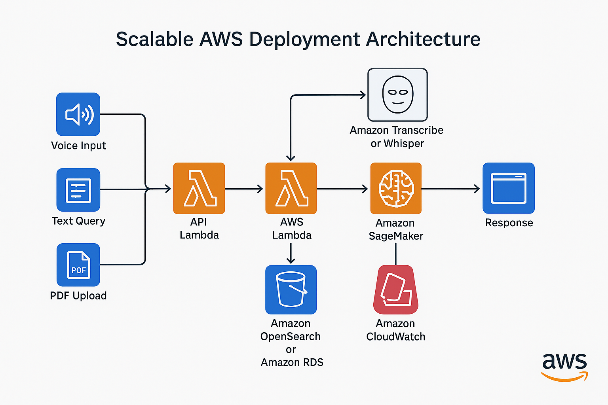
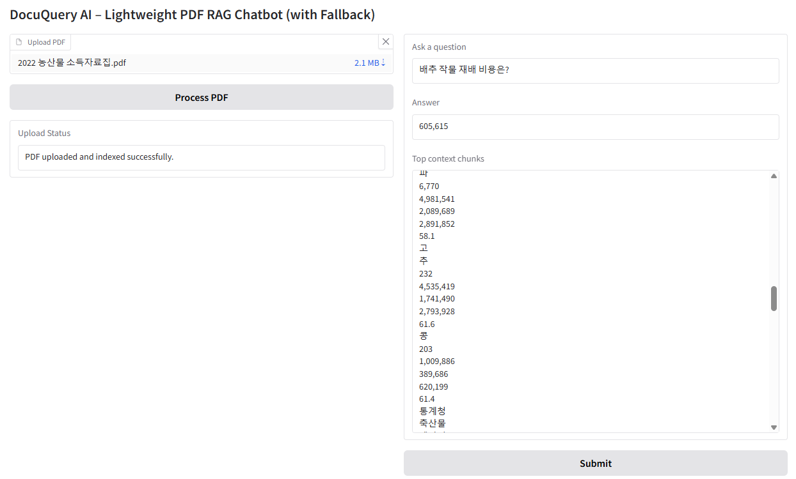

# DocuQuery AI – RAG Chatbot (Lightweight Fallback)

[](https://www.python.org/)  
[](https://huggingface.co/docs/transformers/index)  
[](https://gradio.app/)

This project demonstrates a **lightweight PDF Q&A chatbot** using **Retrieval-Augmented Generation (RAG)**.  
If no relevant content is found in the uploaded PDF, it automatically **falls back** to direct model inference.

---

## Features
- **Document Upload & Parsing**: Upload any PDF and extract text content  
- **Embedding + Vector Search**: Semantic search using `all-MiniLM-L6-v2` + FAISS  
- **RAG Pipeline**: Answers with context from uploaded PDFs  
- **Fallback Mode**: Uses `google/flan-t5-small` for direct inference when no relevant context is found  
- **Lightweight Deployment**: Runs on Hugging Face Spaces free tier (CPU only)  
- **Interactive Web UI** built with Gradio

---

## Architecture


- **PDF Loader**: Extracts text from uploaded files  
- **Vector Store**: Embeds and stores document chunks  
- **Retriever**: Searches top relevant chunks  
- **RAG Chain**: Combines context with query  
- **Fallback**: Uses model-only generation when no context is relevant

---

## Scalable AWS Deployment Architecture
If deployed on AWS, the architecture could be designed as follows:

- **API Gateway** handles all external client requests.
- **AWS Lambda** orchestrates:
  - Voice-to-Text using Amazon Transcribe or Whisper
  - Text-to-SQL or RAG inference via SageMaker Endpoints (FLAN-T5, MiniLM)
- **Amazon OpenSearch or Amazon RDS** handles document retrieval or SQL execution.
- **Amazon S3** stores PDF documents and audio files.
- **Amazon CloudWatch** monitors all components.



---

## Live Demo
[**👉 Try it on Hugging Face Spaces**](https://huggingface.co/spaces/eunki-7/Lightweight-PDF-RAG-Chatbot)

---

## Source Code
[**📂 View on GitHub**](https://github.com/eunki-7/eunki-7-lightweight-pdf-rag-chatbot-portfolio)

---

## How It Works
1. Upload a PDF document  
2. Ask a question in natural language  
3. The system searches for relevant document chunks:  
   - If context found → Answer based on PDF content  
   - If no context → **Fallback to model-only response**  
4. Returns both the **answer** and **top context chunks**

---

## Tech Stack
- [Gradio](https://gradio.app/) – Web UI  
- [Transformers](https://huggingface.co/docs/transformers/index) – Model inference  
- [FAISS](https://faiss.ai/) – Vector similarity search  
- Python 3.10+

---

## Installation & Run
```bash
pip install -r requirements.txt
python app.py
```
---

## Example UI


- This is the web-based interface built with Gradio

---

## Use Cases
- PDF-based Q&A systems (contracts, reports, manuals)
- Knowledge base assistants
- RAG + fallback strategy prototypes
- Customer support document automation

---

## Notes
- First response may take a few seconds (model loading on CPU).
- Subsequent responses are faster due to caching.

---

## Author
**eunki7**  
- [GitHub Profile](https://github.com/eunki-7)
